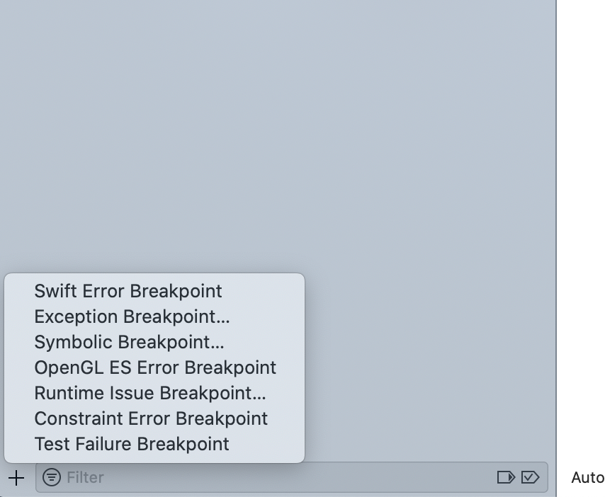

# WWDC2015 Session 413 Advanced Debugging and the Address Sanitizer
In this session, several debugging tools will be demoed in a very pratical way.

## View Debugger
- Focus on troublesome views 
- Visualize your constraints

View Debugger helps you visualize the hiechracy of views in current view. It's a great way to view the relationship between views(sibling and parent/child), also it's a great place to see the auto layout constraints between these views.

## Advanced Breakpoint Actions
- Catch exceptions at throw, print message 
- Print expressions without adding clutter

Under Breakpoint Navigator, user could mannually add variety breakpoints, shows in the following image.

In the demo, click 'Exception Breakpoint' to add a general exception breakpoint, but this would not show any exception error information. 

To display further information about exception error, one trick to do is in the console at the breakpoint, "`po $arg1`" could print out the lastest exception error message in the console, which means we could add this as an action for corresponding breakpoint.
## Address Sanitizer (ASan)
Enable this tool in `Edit Scheme...` under `Diagnostic`

The benifit of using ASan to Analyze Memory Corruption
- Use after free
- Heap buffer overflow
- Stack buffer overflow
- Global variable overflow Overflows in C++ containers 
- Use after return

## Other Tools